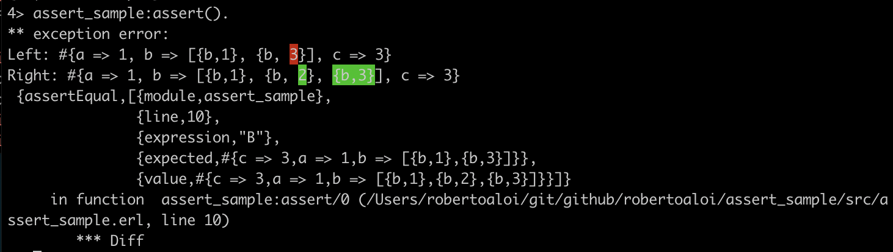
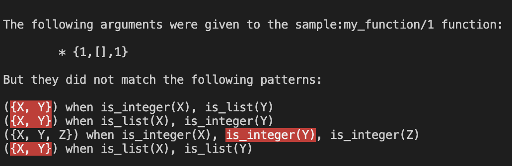

# assert

A test assertion library for Erlang, by WhatsApp.

## Overview

`assert` is an Erlang library which enhances how Erlang errors and
assertions are rendered, making it easier for developers to understand
what is wrong when an error occurs. The library includes:

| File                       | Description                                                                                                                                          |
|----------------------------|------------------------------------------------------------------------------------------------------------------------------------------------------|
| [assert.hrl](#assert-hrl)  | An improved, compatible, versions of Erlang/OTP stdlib's assert macros.                                                                              |
| [wa\_diff.erl](#wa-diff)   | A structural diffing library for Erlang, inspired by Elixir's [ExUnit.Assertions](https://hexdocs.pm/ex_unit/1.12.3/ExUnit.Assertions.html) library. |
| [wa\_blame.erl](#wa-blame) | Exception blaming for Erlang, inspired by Elixir's [Exception](https://hexdocs.pm/elixir/1.6.5/Exception.html) behaviour.                            |

### assert.hrl

The `assert` library provides an `assert.hrl` header file which can be
used as a drop-in replacement for the Erlang/OTP one, part of
`stdlib`.

Let's look at a sample module causing an assertion failure:

```erlang
-module(assert_sample).

-include_lib("stdlib/include/assert.hrl").

-export([assert/0]).

assert() ->
  A = a(),
  B = b(),
  ?assertEqual(A, B).

a() ->
  #{a => 1, b => [{b, 1}, {b, 3}], c => 3}.

b() ->
  #{a => 1, b => [{b, 1}, {b, 2}, {b, 3}], c => 3}.
```

Let's compile run the code:
```
> c(assert_sample).
> assert_sample:assert().
```

Even if the above one is a trivial example, it still takes some effort to realize where the problem is:


Let's replace the `-include_lib` directive to use the `assert` library instead:

```erlang
-include_lib("assert/include/assert.hrl").
```

And run the code again:
```
> c(assert_sample).
> assert_sample:assert().
```



Much easier, isn't it? 🌈

### wa\_diff

`wa_diff` is a structural diffing library for Erlang. Inspired by Elixir's
[ExUnit.Assertions](https://hexdocs.pm/ex_unit/1.12.3/ExUnit.Assertions.html) and
powered by the [diffy](https://github.com/zotonic/diffy) implementation of
[Neil Fraser's match-and-patch algorithm](https://neil.fraser.name/writing/diff/),
it provides a way to diff Erlang data types such as maps, records, lists, tuples and more.

The main entry point is the `compute/2` function which, given two values, produces *left* and *right* parts:

```erlang
> #{left := Left, right := Right, equivalent := Equivalent} = wa_diff:compute(#{one => 1, two => 2}, #{one => 1, two => 3}).
#{left =>
      {map,[],[{one,1},{two,#{contents => [{true,<<"2">>}]}}]},
  right =>
      {map,[],[{one,1},{two,#{contents => [{true,<<"3">>}]}}]},
  equivalent => false}
```

Each part can then be rendered via the `to_diff/3` function. For example:

```erlang
> wa_diff:to_diff(Left, ~"-", ~"-").
{ok,"#{one => 1, two => -2-}"}

> wa_diff:to_diff(Right, ~"+", ~"+").
{ok,"#{one => 1, two => +3+}"}
```

Records can be pretty-printed by providing a third argument to the `compute/3` function,
i.e. the module containing the record definition to be used for pretty-printing.

### wa\_blame

[wa\_blame] implements "Exception Blaming" for Erlang errors,
enhancing the stacktrace for errors.

For example, during a *function clause* error, `wa_blame` can figure out why each clause did not match.

Given a `sample` module containing the following function definition:

```erlang
my_function({X, Y}) when is_integer(X), is_list(Y) -> ok;
my_function({X, Y}) when is_list(X), is_integer(Y) -> ok;
my_function({X, Y, Z}) when is_integer(X), is_integer(Y), is_integer(Z) -> ok;
my_function({X, Y}) when is_list(X), is_list(Y) -> ok.
```

A typical *function clause* error would look like:

```erlang
> sample:my_function({1, [], 1}).
** exception error: no function clause matching sample:my_function({1,[],1}) (sample.erl, line 6)
```

We can intercept the error via a `try/catch` and enhance it via `wa_blame`:

```erlang
> {ok, Message} = try
                    sample:my_function({1, [], 1})
                  catch Error:Reason:Stacktrace ->
                    wa_blame:format_blame(Reason, Stacktrace)
                  end.
```



## Usage

### In a rebar3 Project
To add `assert` to your rebar3 project, simply add it to the `deps` in your `rebar.config`:

```
{deps, [
  {assert, {git, "http://github.com/whatsapp/assert.git"}}
]}.
```

## Requirements

`assert` requires Erlang/OTP 26.

## License
`assert` is Apache 2.0 licensed, as found in the [LICENSE](LICENSE.md) file.

## References

* [Terms of Use](https://opensource.fb.com/legal/terms)
* [Privacy Policy](https://opensource.fb.com/legal/privacy)

## Copyright

Copyright © Meta Platforms, Inc
